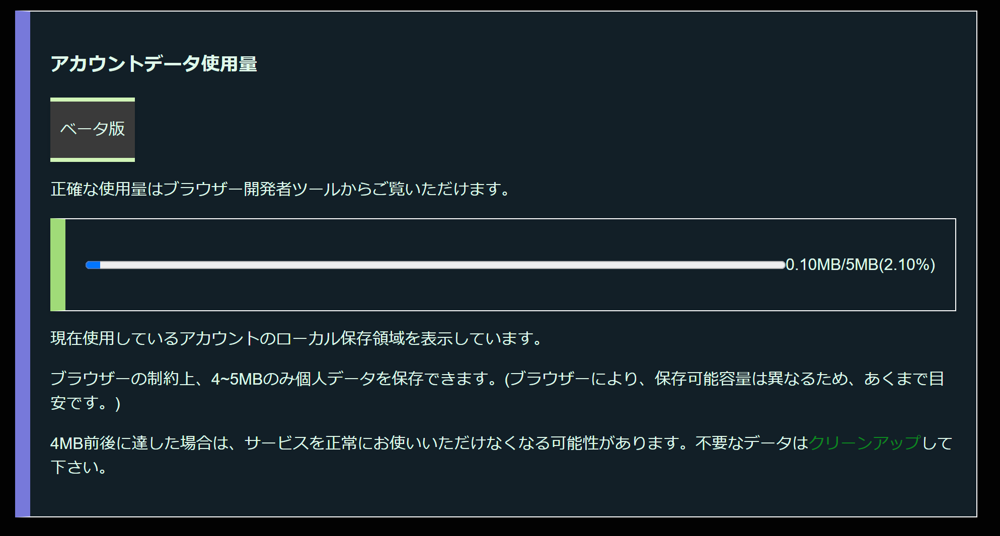

# calcLocalstorage_script
[J] CaffeineAppsにて使用したcalcls単品  
## What is this?  
LocalStorageの利用可能残量を推測して表示するスクリプトです。 ここのリポジトリからこのスクリプトを入手する場合はMITライセンスが適用されます。(CaffeineAppsのリポジトリでは横茶横葉Bライセンス)  
## 画像で実装例を見る  
  

```test.html
        <div class="A" style="display: flex; flex-direction: row; justify-content: space-between; align-items: center;" id="datausagecontainer">
            <progress id="datausagebar" value="0" max="100" style="width: 100%;"></progress>
            <p id="datausage">0MB/5MB</p>
        </div>
```
